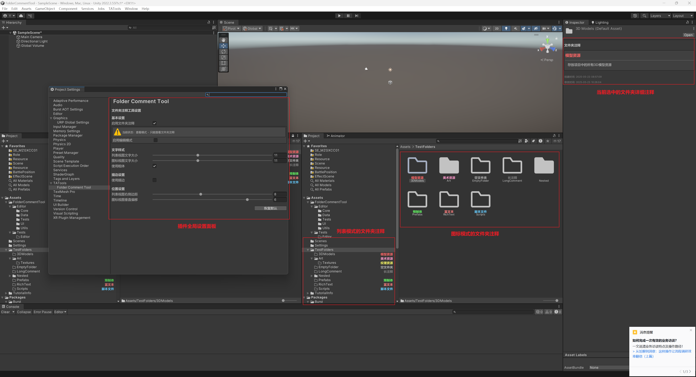
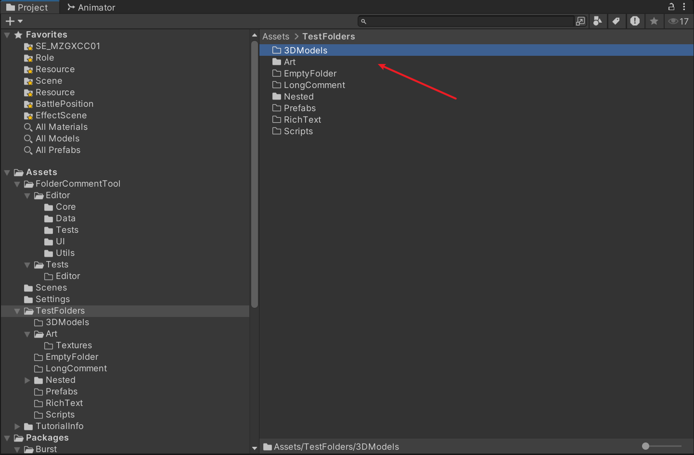
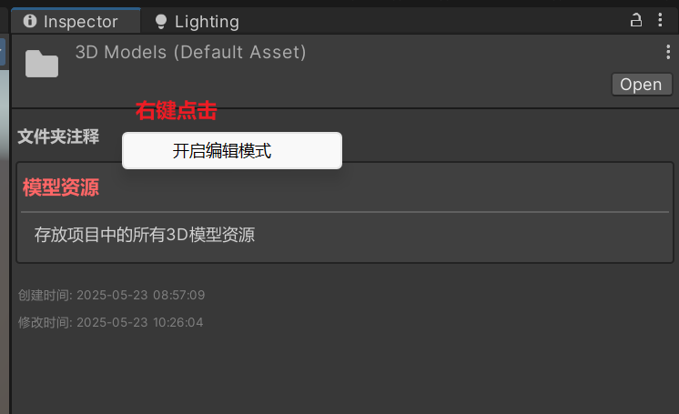
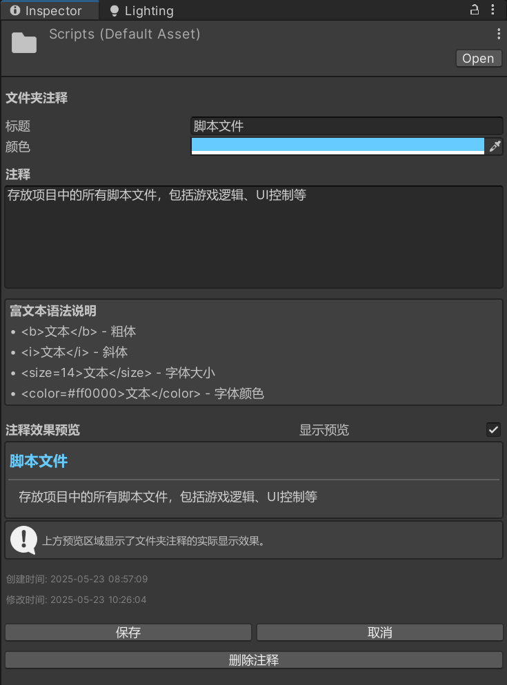
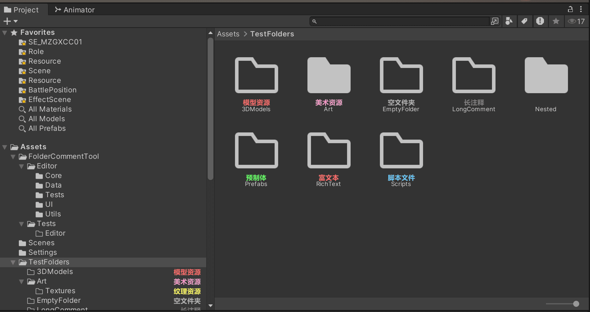
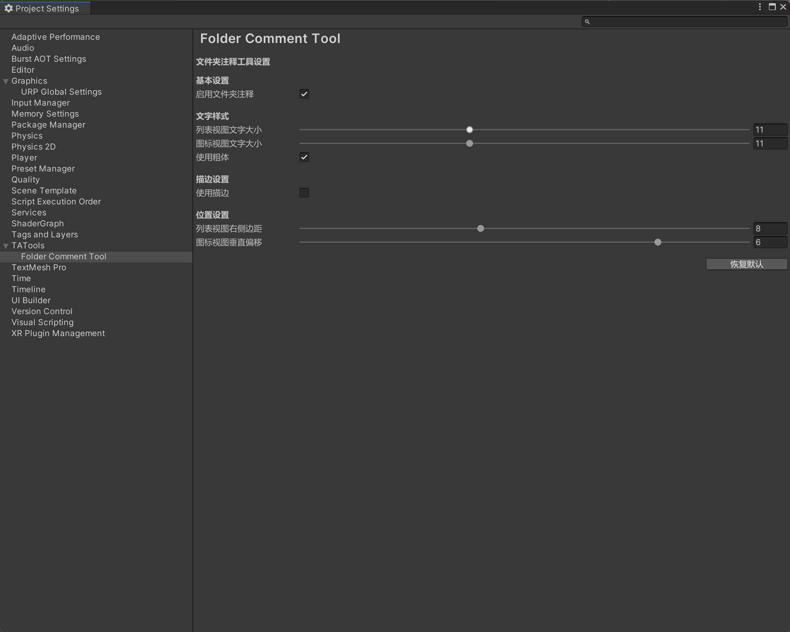

# Folder Comment Tool 使用文档

> 版本：v1.1.0
> 更新时间：2025年1月

## 目录

1. [简介](#简介)
2. [快速开始](#快速开始)
3. [功能说明](#功能说明)
4. [设置配置](#设置配置)
5. [常见问题](#常见问题)
6. [技术支持](#技术支持)

---

## 简介

Folder Comment Tool 是一个Unity编辑器扩展工具，让您可以为项目中的文件夹添加注释，并在Project窗口中直观地显示这些注释，帮助快速理解各个文件夹的用途和内容。

### 主要特性

- 📁 **直观显示**：在Project窗口中直接显示文件夹注释
- 🎨 **多种模式**：支持列表模式和图标模式下的注释显示
- ✏️ **便捷编辑**：在Inspector面板中编辑详细注释
- 🌈 **自定义颜色**：支持自定义颜色选择
- 📝 **富文本支持**：支持粗体、斜体、颜色、大小等格式
- ⏰ **时间记录**：自动记录注释的创建和修改时间
- 🎯 **稳定关联**：文件夹移动或重命名不丢失注释

---

## 快速开始

### 第一步：选择文件夹


1. 在Unity的Project窗口中，点击选择任意一个文件夹
2. 确保文件夹处于选中状态（高亮显示）


### 第二步：进入编辑模式

1. 选择文件夹后，在Inspector面板中会出现 **"文件夹注释"** 区域
2. **右键点击** "文件夹注释" 标题
3. 在弹出菜单中选择 **"开启编辑模式"**

### 第三步：编辑注释



1. 在 **"标题"** 输入框中输入简短的注释标题（如："脚本文件"）
2. 点击 **颜色选择器** 选择注释文字的显示颜色
3. 在 **"详细注释"** 文本区域中输入详细说明
4. 参考富文本语法说明，可以选择复制需要的格式标签
5. 在预览区域查看效果
6. 点击 **"保存"** 按钮保存注释并退出编辑模式

### 第四步：查看效果


保存后，注释将立即在Project窗口中显示：
- **列表模式**：注释显示在文件夹名称的右侧
- **图标模式**：注释显示在文件夹图标下方，文件名上方

---

## 功能说明

### 注释编辑界面

#### 1. 标题设置
- **功能**：设置在Project窗口中显示的简短标题
- **建议**：不超过20个字符，使用简洁明了的词语，如"UI界面"、"音效资源"等

#### 2. 颜色选择
- **颜色选择器**：使用Unity标准的颜色选择器
- **自定义颜色**：可选择任意颜色
- **颜色预览**：选择后立即在预览区域中查看效果

#### 3. 详细注释
- **多行支持**：支持多行文本输入
- **富文本格式**：支持以下格式标记：
  - `<b>文本</b>` - 粗体
  - `<i>文本</i>` - 斜体
  - `<size=14>文本</size>` - 字体大小
  - `<color=#ff0000>文本</color>` - 字体颜色

#### 4. 时间信息
- **创建时间**：显示注释首次创建的时间
- **修改时间**：显示注释最后修改的时间

### Project窗口显示

#### 列表模式
- **位置**：注释显示在文件夹名称右侧
- **对齐**：右对齐显示
- **截断**：超长文字自动截断并显示省略号

#### 图标模式
- **位置**：注释显示在文件夹图标下方，文件名上方
- **居中**：文字居中对齐
- **换行**：支持自动换行显示

### 编辑模式

#### 进入编辑模式
- **方式**：右键点击"文件夹注释"标题，选择"开启编辑模式"
- **功能**：可以修改当前文件夹的注释内容

#### 查看模式
- **功能**：只能查看注释内容，无法修改
- **切换**：右键点击标题可进入编辑模式

#### 数据保护
- **保存确认**：只有点击"保存"按钮才会真正保存
- **切换保护**：切换目标时会询问是否保存未保存的修改

---

## 设置配置

### 打开设置面板

1. 选择菜单 `Edit > Project Settings`
2. 在左侧面板中找到 `TATools`
3. 点击 `Folder Comment Tool`

### 设置选项

#### 基础设置
- **启用文件夹注释**：总开关，控制整个功能的启用/禁用
- **默认文字颜色**：新建注释时的默认颜色
- **文字大小**：调整Project窗口中注释文字的大小（8-16px）

#### 显示设置
- **显示创建时间**：是否在Inspector中显示创建时间
- **显示修改时间**：是否在Inspector中显示修改时间
- **启用富文本**：是否支持富文本格式

#### 编辑设置
- **默认编辑模式**：新选择文件夹时是否默认进入编辑模式
- **自动保存**：是否在失去焦点时自动保存
- **确认删除**：删除注释时是否显示确认对话框

#### 性能设置
- **最大显示数量**：Project窗口中同时显示的注释数量上限
- **刷新频率**：界面刷新的频率设置

---

## 常见问题

### Q1：注释不显示怎么办？

**解决步骤：**
1. **检查功能启用**：在Project Settings > TATools > Folder Comment Tool中检查是否启用
2. **重新选择文件夹**：点击其他文件夹再回到目标文件夹
3. **查看控制台**：检查Unity控制台是否有错误信息
4. **重启Unity**：如果问题持续，尝试重启Unity编辑器

### Q2：注释保存后丢失？

**可能原因：**
- 项目设置文件权限问题
- 磁盘空间不足
- Unity版本兼容性问题

**解决方法：**
1. **检查文件权限**：确保ProjectSettings目录有写入权限
2. **检查磁盘空间**：确保磁盘有足够的剩余空间
3. **版本兼容性**：更新到支持的Unity版本（2022.3+）

### Q3：性能影响如何？

**性能优化措施：**
- 插件采用延迟加载机制，只在需要时初始化
- 只在Project窗口可见时绘制注释
- 可在设置中限制同时显示的注释数量

**大型项目建议：**
- 将最大显示数量设置为50-100
- 调整刷新频率为中等或低频

### Q4：多人协作时注释同步问题？

**注意事项：**
- **数据位置**：注释数据存储在`ProjectSettings/FolderComments.json`
- **版本控制**：建议将此文件加入版本控制系统
- **同步方式**：团队成员需要同步此文件以共享注释

**最佳实践：**
1. 在`.gitignore`中确保不排除`ProjectSettings/FolderComments.json`
2. 定期提交注释数据的更改
3. 团队约定注释的命名规范

### Q5：注释文字显示异常？

**常见问题及解决：**

#### 文字被截断
- **原因**：文字过长或窗口太窄
- **解决**：缩短注释文字或调整Project窗口宽度

#### 颜色显示错误
- **原因**：Unity主题或皮肤影响
- **解决**：在设置中重新选择颜色或使用预设颜色

#### 富文本不生效
- **原因**：富文本功能被禁用
- **解决**：在设置中启用富文本支持

---

## 使用技巧

### 1. 颜色编码系统

建议的颜色使用规范：
- **红色**：核心系统、重要功能模块
- **橙色**：配置文件、设置相关
- **黄色**：临时文件、测试内容
- **绿色**：美术资源、音频素材
- **蓝色**：脚本代码、逻辑文件
- **紫色**：第三方插件、工具
- **灰色**：废弃内容、待删除

### 2. 富文本格式技巧

常用富文本标记：
```
<b>粗体文字</b>
<i>斜体文字</i>
<color=red>红色文字</color>
<color=#FF0000>十六进制颜色</color>
<size=14>大号文字</size>
<size=10>小号文字</size>
```

组合使用示例：
```
<b><color=blue>重要蓝色标题</color></b>
<i><size=12>中等大小斜体说明</size></i>
```

### 3. 团队协作建议

- 制定团队统一的注释命名规范
- 使用一致的颜色编码系统
- 定期提交注释数据的更改
- 重要注释变更时通知团队成员

---

## 技术支持

### 联系方式

- **GitHub Issues**：https://github.com/fenglyu1314/FolderCommentTool/issues
- **邮箱**：fenglyu@foxmail.com

### 反馈信息模板

提交问题时，请按以下模板提供信息：

```
【问题类型】：Bug报告 / 功能请求 / 使用咨询

【环境信息】
- Unity版本：
- 插件版本：
- 操作系统：

【问题描述】
详细描述遇到的问题...

【复现步骤】
1.
2.
3.

【期望结果】
描述期望的正确行为...

【实际结果】
描述实际发生的情况...
```

### 常用资源链接

- **项目主页**：https://github.com/fenglyu1314/FolderCommentTool
- **更新日志**：https://github.com/fenglyu1314/FolderCommentTool/blob/main/CHANGELOG.md

---

## 许可证信息

本项目采用 **MIT 许可证**，您可以自由使用、修改和分发。

### 许可证特点

✅ **自由使用**：可以在任何项目中免费使用

✅ **修改权限**：允许修改源代码以满足您的需求

✅ **分发权限**：可以重新分发原始或修改后的版本

✅ **商业使用**：允许在商业项目中使用

### 使用条件

唯一的要求是在分发时保留原始的版权声明和许可证文本。

详细许可条款请参阅项目根目录下的 [LICENSE.md](../LICENSE.md) 文件。

---

*文档版本：v1.1.0*
*最后更新：2025年1月*
*文档作者：喵喵Mya*
